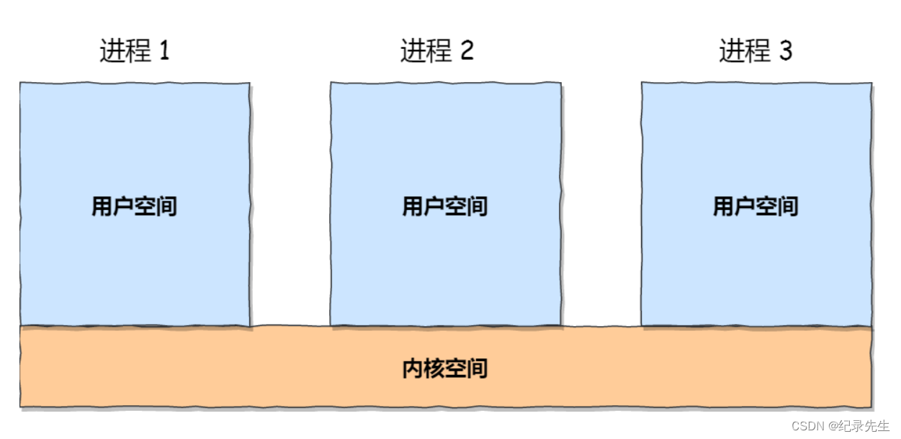
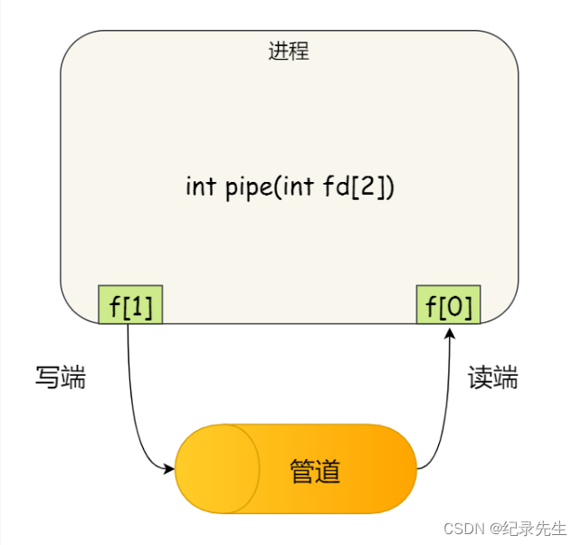
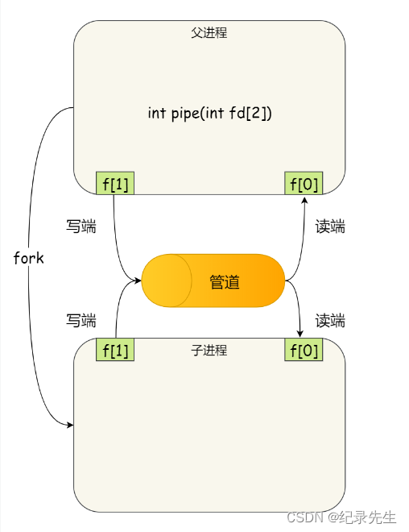
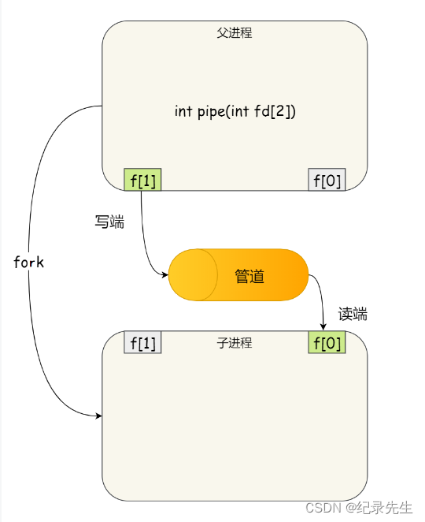
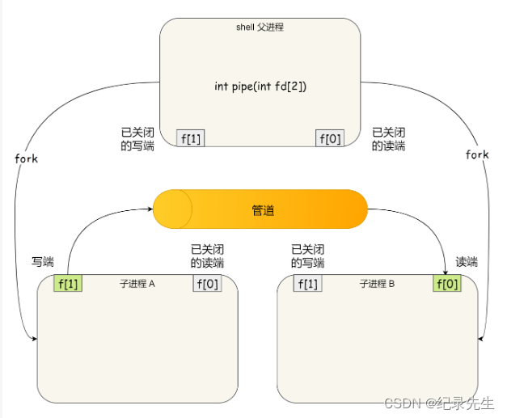
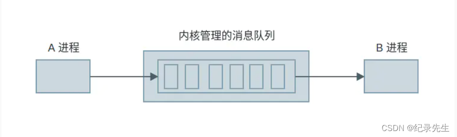
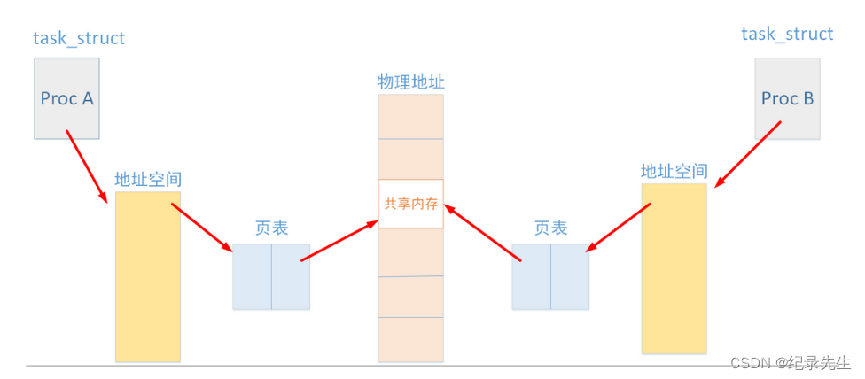
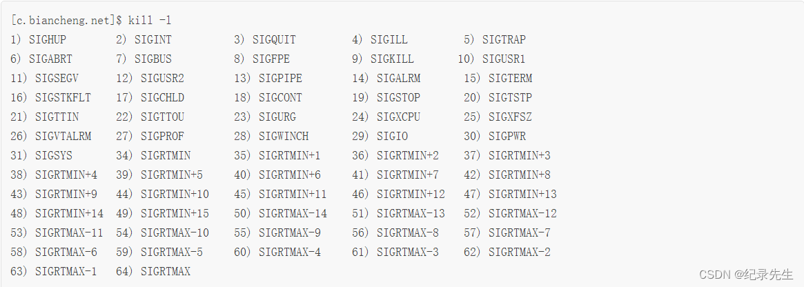
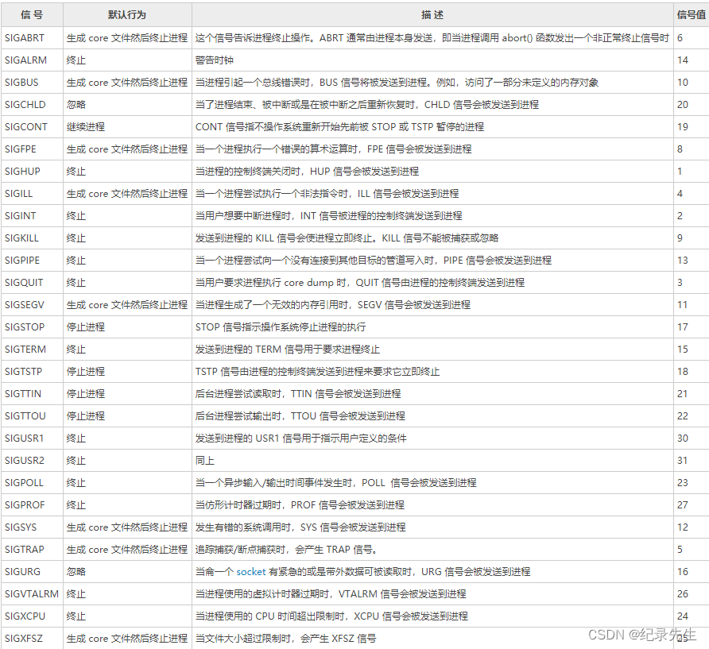
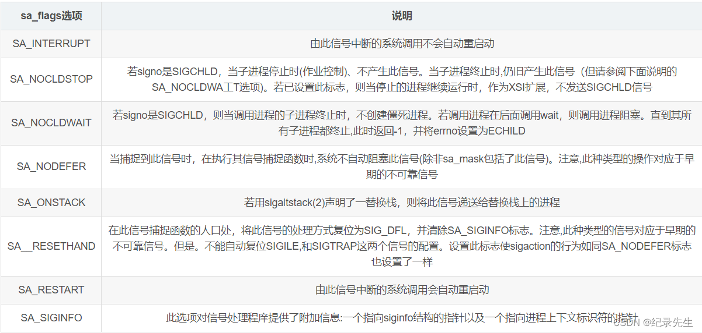

进程间通信（IPC，InterProcess Communication）是指在不同进程之间传播或交换信息。 <!-- more -->    
IPC的方式通常有管道（包括无名管道和命名管道）、消息队列、信号量、共享存储、Socket、Streams等。其中 Socket和Streams支持不同主机上的两个进程IPC。

# 1 管道
管道，通常指无名管道，是 UNIX 系统IPC最古老的形式。
## 特点：
>- 它是半双工的（即数据只能在一个方向上流动），具有固定的读端和写端。
>- 它只能用于具有亲缘关系的进程之间的通信（也是父子进程或者兄弟进程之间）。
>-它可以看成是一种特殊的文件，对于它的读写也可以使用普通的read、write 等函数。但是它不是普通的文件，并不属于其他任何文件系统，并且只存在于内存中。  

每个进程的用户地址空间都是独立的，一般而言是不能互相访问的，但内核空间是每个进程都共享的，所以进程之间要通信必须通过内核。


函数原型：
```bash
#include <unistd.h>
 int pipe(int fd[2]);    // 返回值：若成功返回0，失败返回-1
 ```

返回值：若成功返回0，失败返回-1     
当一个管道建立时，它会创建两个文件描述符：fd[0]为读而打开，fd[1]为写而打开。        

这里表示创建一个匿名管道，并返回了两个描述符，一个是管道的读取端描述符 fd[0]，另一个是管道的写入端描述符 fd[1]。注意，这个匿名管道是特殊的文件，只存在于内存，不存于文件系统中。
    
其实，所谓的管道，就是内核里面的一串缓存。从管道的一段写入的数据，实际上是缓存在内核中的，另一端读取，也就是从内核中读取这段数据。另外，管道传输的数据是无格式的流且大小受限。

看到这，你可能会有疑问了，这两个描述符都是在一个进程里面，并没有起到进程间通信的作用，怎么样才能使得管道是跨过两个进程的呢？

我们可以使用 fork 创建子进程，创建的子进程会复制父进程的文件描述符，这样就做到了两个进程各有两个「 fd[0] 与 fd[1]」，两个进程就可以通过各自的 fd 写入和读取同一个管道文件实现跨进程通信了。
    
管道只能一端写入，另一端读出，所以上面这种模式容易造成混乱，因为父进程和子进程都可以同时写入，也都可以读出。那么，为了避免这种情况，通常的做法是：

>- 父进程关闭读取的 fd[0]，只保留写入的 fd[1]；
>- 子进程关闭写入的 fd[1]，只保留读取的 fd[0]；

    
所以说如果需要双向通信，则应该创建两个管道。

到这里，我们仅仅解析了使用管道进行父进程与子进程之间的通信，但是在我们 shell 里面并不是这样的。

在 shell 里面执行 A | B命令的时候，A 进程和 B 进程都是 shell 创建出来的子进程，A 和 B 之间不存在父子关系，它俩的父进程都是 shell。
    
所以说，在 shell 里通过「|」匿名管道将多个命令连接在一起，实际上也就是创建了多个子进程，那么在我们编写 shell 脚本时，能使用一个管道搞定的事情，就不要多用一个管道，这样可以减少创建子进程的系统开销。

我们可以得知，对于匿名管道，它的通信范围是存在父子关系的进程。因为管道没有实体，也就是没有管道文件，只能通过 fork 来复制父进程 fd 文件描述符，来达到通信的目的。

注意：对于命名管道，它可以在不相关的进程间也能相互通信。因为命令管道，提前创建了一个类型为管道的设备文件，在进程里只要使用这个设备文件，就可以相互通信。    
__不管是匿名管道还是命名管道，进程写入的数据都是缓存在内核中，另一个进程读取数据时候自然也是从内核中获取，同时通信数据都遵循先进先出（先写后读）原则，不支持 lseek 之类的文件定位操作__。

例子如下：
```c
#include <stdio.h>
#include <unistd.h>
#include <string.h>
#include <stdlib.h>

int main()
{
	int fd[2];
	pid_t pidl
	char buf[128];

	if(pipe(fd) == -1){
		printf("creat pipe failed\n");
	}

	pid = fork();

	if(pid < 0){
		printf("creat child failed\n");
	}
	else if(pid > 0){
		printf("this is father\n");
		close(fd[0]);//关闭读
		write(fd[1],"hello from father",strlen("hello from father"));//关闭写
		wait(NULL);
	}else{
		printf("this is child\n");
		close(fd[1]);//关闭写
		read(fd[0],buf,128);
		printf("read from father:%s\n",buf);
		exit(0);
	}
	
	return 0;
}

输出结果：
this is father
this is child
read from father:hello from father
```

# 2 创建命名管道(FIFO)
FIFO，也称为命名管道，它是一种文件类型。

## 特点
>- FIFO可以在无关的进程之间交换数据，与无名管道不同。
>- FIFO有路径名与之相关联，它以一种特殊设备文件形式存在于文件系统中。   

函数原型：
```c
include <sys/stat.h>
// 返回值：成功返回0，出错返回-1
 int mkfifo(const char *pathname, mode_t mode);
```
返回值：成功返回0，出错返回-1   
其中的 mode 参数与open函数中的 mode 相同。一旦创建了一个 FIFO，就可以用一般的文件I/O函数操作它。    

    若没有指定O_NONBLOCK（默认），只读 open 要阻塞到某个其他进程为写而打开此 FIFO（只读 open程序会等到其他进程写内容进管道后才会执行下去，否则则一直等待其他进程写内容进管道，形成阻塞）。类似的，只写 open 要阻塞到某个其他进程为读而打开它。

    若指定了O_NONBLOCK，则只读 open 立即返回。而只写 open 将出错返回 -1 如果没有进程已经为读而打开该 FIFO，其errno置ENXIO。

在前面的文章中我们已经对命名管道进行了简单介绍，我们知道命名管道的本质就是文件系统中的一个特殊设备文件，即管道文件（FIFO）。虽然它和其他普通文件的用途不同，但它的打开方式却和普通文件相同，都是通过调用open函数来打开。通常而言，打开管道文件的方式有以下几种：

>- 只读且阻塞方式   
>  open(const char *pathname, O_RDONLY);
>- 只读且非阻塞方式     
    open(const char *pathname, O_RDONLY | O_NONBLOCK);
>- 只写且阻塞方式       
open(const char *pathname, O_WRONLY);
>- 只写且非阻塞方式         
open(const char *pathname, O_WRONLY | O_NONBLOCK);

注：在这里我们需要注意一点，就是不能以 O_RDWR 方式打开管道文件，这种行为是未定义的。倘若有一个进程以读写方式打开了某个管道，那么该进程写入的数据又会被该进程本身读取，而管道一般只用于进程间的单向数据通信。

例子如下：
创建命名管道
```c
#include <sys/types.h>
#include <sys/stat.h>

// int mkfifo(const char *pathname,mode_t mode);

int main()
{
	mkfifo("./file",0600);//文件名，模式
	
	return 0;
}

输出结果：
file1 文件会出现 prw，就是管道+可读+可写的意思
```
```c
#include <sys/types.h>
#include <sys/stat.h>
#include <stdio.h>

// int mkfifo(const char *pathname,mode_t mode);

int main()
{
	int ret = mkfifo("./file",0600);//文件名，模式
	if(ret == 0){
		printf("mkfifo success");
	}
	if(ret == -1){
		printf("mkfifo failed");
		perror("why");
	}


	return 0;
}

输出结果：失败的可能原因是文件可能存在
mkfifo failed
why:File exists
```
```c
// 对以上两个例子进行了优化
#include <sys/types.h>
#include <sys/stat.h>
#include <stdio.h>
#include <errno.h>

// int mkfifo(const char *pathname,mode_t mode);

int main()
{
	if((mkfifo("./file",0600)==-1) && errno == EEXIST){//文件名，模式
		printf("mkfifo failed");
		perror("why");
	}else{
		if(errno == EEXIST){
			printf("file exisit\n");
		}else{
			printf("mkfifo success\n");
		}
	}	
	return 0;
}

输出结果：
没有file文件 mkfifo success
有file文件 file exisit
```
下面举例解释只读 open 要阻塞到某个其他进程为写而打开此 FIFO

```c
#include <sys/types.h>
#include <sys/stat.h>
#include <stdio.h>
#include <errno.h>
#include <fcntl.h>

// int mkfifo(const char *pathname,mode_t mode);

int main()
{
	if((mkfifo("./file",0600)==-1) && errno == EEXIST){//文件名，模式
		printf("mkfifo failed");
		perror("why");
	}
	int fd = open("./file",O_RDONLY);	
	printf("open successful\n");

	return 0;
}

Linux命令行:
gcc read.c -o read
运行./read
输出结果没有，为什么，
因为只读 open 要阻塞到某个其他进程为写而打开此 FIFO。
被阻塞了
```
```c
#include <sys/types.h>
#include <sys/stat.h>
#include <stdio.h>
#include <errno.h>
#include <fcntl.h>

// int mkfifo(const char *pathname,mode_t mode);

int main()
{
	int fd = open("./file",O_WRONLY);
	printf("write open successful\n");
	
	return 0;
}

接上面 如何让上面不阻塞
gcc write.c -o write
先在read.c的命令行窗口运行./read
后在write.c的命令行在运行./write
read.c的命令行窗口输出结果:open successful
write.c的命令行输出结果:write open successful
```
下面是读：
```c
#include <sys/types.h>
#include <sys/stat.h>
#include <stdio.h>
#include <errno.h>
#include <fcntl.h>

// int mkfifo(const char *pathname,mode_t mode);

int main()
{
	char buf[20] = {0};

	if((mkfifo("./file",0600)==-1) && errno == EEXIST){//文件名，模式
		printf("mkfifo failed");
		perror("why");
	}
	int fd = open("./file",O_RDONLY);	
	printf("open successful\n");

	int n_read = read(fd,buf,20);

	printf("read %d byte from fifo.context:%s\n",n_read,buf);
	close(fd);

	return 0;
}
```
下面是写
```c
#include <sys/types.h>
#include <sys/stat.h>
#include <stdio.h>
#include <errno.h>
#include <fcntl.h>
#include <string.h>

// int mkfifo(const char *pathname,mode_t mode);

int main()
{
	char *str = "message from fifo";

	int fd = open("./file",O_WRONLY);
	printf("write open successful\n");

	write(fd,str,strlen(str));
	close(fd);
	
	return 0;
}


Linux命令行：
先在read.c的命令行窗口运行./read
先在write.c的命令行窗口运行./write
write open successful
open successful
read 17 byte from fifo.context:message from fifo
```

# 3 消息队列
消息队列，是消息的链接表，存放在内核中。一个消息队列由一个标识符（即队列ID）来标识。

## 特点

>- 消息队列是面向记录的，其中的消息具有特定的格式以及特定的优先级。
>- 消息队列独立于发送与接收进程。进程终止时，消息队列及其内容并不会被删除。
>- 消息队列可以实现消息的随机查询,消息不一定要以先进先出的次序读取,也可以按消息的类型读取。
消息队列的原理  

MQ 传递的是消息，消息即是我们需要在进程间传递的数据。MQ 采用链表来实现消息队列，该链表是由系统内核维护，系统中可能有很多的 MQ，每个 MQ 用消息队列描述符（消息队列 ID：qid）来区分，qid 是唯一的，用来区分不同的 MQ。在进行进程间通信时，一个进程将消息加到 MQ 尾端，另一个进程从消息队列中取消息（不一定以先进先出来取消息，也可以按照消息类型字段取消息），这样就实现了进程间的通信。如下 MQ 的模型：        
         
进程 A 向内核维护的消息队列中发消息，进程 B 从消息队列中取消息，从而实现了 A 和 B 的进程间通信。了解了原理，来看看如何使用 MQ。

## 使用消息队列
MQ 的 API 操作与共享内存几乎是相同的，分为下面 4 个步骤来分别学习这些函数：

>- 创建和访问 MQ
>- 发送消息
>- 接受消息
>- 删除 MQ
```c
#include <sys/msg.h>

 int msgget(key_t key, int flag);
 // 创建或打开消息队列：成功返回队列ID，失败返回-1
int msgsnd(int msqid, const void *ptr, size_t size, int flag);
// 添加消息：成功返回0，失败返回-1
 int msgrcv(int msqid, void *ptr, size_t size, long type,int flag);
// 读取消息：成功返回消息数据的长度，失败返回-1
 int msgctl(int msqid, int cmd, struct msqid_ds *buf);
// 控制消息队列：成功返回0，失败返回-1
```
## 创建：msgget
**使用 msgget 可以创建一个消息队列，需要指定创建的 key 和标志，key 与返回的 id 有关系。**

```c
#include <sys/types.h>
#include <sys/ipc.h>
#include <sys/msg.h>
/*
 * key：用来指定返回 MQ 的 ID，可以通过key_t ftok( const char * fname, int id )得到
 * msgflg：创建的标志，例如 IPC_CREAT
 * return：成功返回队列 ID，失败返回 -1, 并设置 erron
 */
int msgget(key_t key, int msgflg);
```
### msgflg详细：
消息队列操作标志位：

>- IPC_CREAT：如果key对应的消息队列对象不存在，则创建；否则则进行打开操作，返回0。
>- IPC_EXCL：如果key对应的消息队列对象不存在，则返回-1；否则则进行打开操作，返回0。
在引用IPC_CREAT的基础上，我们可以或上去一个mode值，以代表创建的消息队列的权限，这个mode值其实就是open函数里面一样原理
>- IPC_CREAT | 0666： 代表不存在就创建且设置权限为0666，存在就打开
>- IPC_CREAT | IPC_EXCL | 0666： 代表存在就报错，不存在就创建并打开     
> 权限控制：0666表示可读可写，和上面的IPC_CREAT做逻辑 或 操作。   
指定创建时的原始权限，比如0666

创建一个新的消息队列时，除了原始权限，还需要指定IPC_CREAT选项。
```c
msgid = msgget(key, 0666|IPC_CREAT);
```
如果key值没有对应任何消息队列，就会创建一个新的消息队列，此时就会用到msgflg参数，但是如果key已经对应了某个早已存在消息队列，就直接返回这个已存在消息队列的ID（标识符），此时不会用到msgflg参数。

### 可以通过ftok函数来生成key
__ftok通过指定路径名和一个整形数，就可以计算并返回一个唯一对应的key值，只要路径名和整形数不变，所对应的key值就唯一不变的。__

函数原型

```c
#include <sys/types.h>
#include <sys/ipc.h>
key_t ftok( const char * fname,int proj_id );
```
返回值：    
成功返回一个IPC对象的key值，失败则返回-1，errno会被设置         
fname就是你指定的文件名（已经存在的文件名），一般使用当前目录，     
例子如下：

```c
key_t key;
key = ftok(".", 1); 这样就是将fname设为当前目录
```
    proj_id是子序号。虽然是int类型，但是只使用8bits(1-255），这个是一个不为0的小于或等于255的数值，用来跟pathname组合得到IPC的key,用来区分相同路径下的不同的 key。      
    在一般的UNIX实现中，是将文件的索引节点号取出，前面加上子序号得到key_t的返回值。
    指定文件的索引节点号为65538，换算成16进制为0x010002，而你指定的ID值为38，换算成16进制为0x26，则最后的key_t返回值为0x26010002。
值得注意的是，不管是接受消息队列还是在发送消息队列时，都需要用户自己定义一个结构体，用来存储数据，并作为函数参数传入。  

结构体如下（自由定义）：

```c
struct msgbuf{
    long mtype;
    char mtext[1];
}
```
这个结构体存在两个成员，一个是long型的变量，表示该消息的类型，因为消息队列的特性，在发送或者接受消息是要明确消息的类型，这样在就可以指定的读取某一个或者或者某一类的消息，同时可以改变消息接受的优先级。

至于为什么需要这个数据结构，是因为消息队列是面向数据块的，读取数据和发送数据都是以结构体的形式进行传递，因此需要我们自己定义数据结构，面向数据块也是消息队列的一个重要特性。

### 发送：msgsnd
使用 msgsnd 来发送一个消息，必须要有写消息队列的权限。      
函数原型：

```c
#include <sys/types.h>
#include <sys/ipc.h>
#include <sys/msg.h>

/*
 * msgid：消息队列 ID
 * msgp：指向 msgbuf 的指针，用来指定发送的消息
 * msgsz：要发送消息的长度
 * msgflg：创建标记，如果指定 IPC_NOWAIT，失败会立刻返回
 * return：成功返回 0, 失败返回 -1, 并设置 erron
 */
int msgsnd(int msqid, const void *msgp, size_t msgsz, int msgflg);
```
#### msqid：你要将数据发送到哪个消息队列中，传入指定的消息队列的ID

#### msgp：消息结构体指针。
    系统规定我们需要去定义一个结构体类型：


```c 
truct msgbuf {    
    /* 消息类型，必须是大于0的一个数字 */    
    long mtype;       
    /* 消息的内容，这个数组的大小是可以变化的，最大大小不能超过MAXMNB，也就是16k*/     
    char mtext[1];     
};
```
#### msgsz：消息正文的长度，跟上面定义的mtext大小是一致的

#### msgflg：发送数据的操作标志
>- 0：以默认的模式进行发送数据，即：当缓冲区满了继续发会阻塞。
>- IPC_NOWAIT：以非阻塞模式进行发送数据。即：当消息队列的缓冲区满了之后，继续发送不会阻塞，而是会立即出错返回。     
返回值：    
    成功则返回0，失败则返回-1，errno会被设置

### 接收：msgrcv
使用 msgrcv 来从 msgqid 标识的 MQ 中读取一个消息放到 msgp 指定的内存中，必须要有读消息队列的权限。

```c
#include <sys/types.h>
#include <sys/ipc.h>
#include <sys/msg.h>
/*
 * msgid：消息队列 ID
 * msgp：指向 msgbuf 的指针，用来接收消息
 * msgsz：要接收消息的长度
 * msgtyp：接收消息的方式
 * msgflg：创建标记，如果指定 IPC_NOWAIT，获取失败会立刻返回
 * return：成功返回实际读取消息的字节数, 失败返回 -1, 并设置 erron
 */
ssize_t msgrcv(int msqid, void *msgp, size_t msgsz, long msgtyp, int msgflg);
```

#####  msgtyp 绝对值的第一条消息     
##### msqid：指定的消息队列的 ID。      
##### msgp：消息结构体指针。        
##### msgsz：消息结构体中存放正文的内存空间的最大值。
    注意：参数 msgsz 指定由 msgp 参数指向的结构的成员 mtext 的最大大小（以字节为单位）
##### msgtyp：指定接收消息的标签（类型）。
>   msgtyp 也有 3 种方式：
>- msgtyp = 0：读取队列中的第一条消息
>- msgtyp > 0：读取队列中类型为 msgtyp 的第一条消息，除非在 msgflg 中指定了 MSG_EXCEPT，否则将读取类型不等于 msgtyp 的队列中的第一条消息。
>- msgtyp < 0：读取队列中最小类型小于或等于 
##### msgflg：可选项。  
>-   0：以默认的模式进行接收数据，即：当消息队列中没有消息时会阻塞。         
>-   IPC_NOWAIT：以非阻塞模式进行接收数据。即：当消息队列没有消息时，继续收不会阻塞，而是会立即出错返回。 

返回值：    
成功则返回消息队列的id，失败则返回-1，并且errno会被设置

### 删除及控制：msgctl
函数原型：

```c
#include <sys/types.h>
#include <sys/ipc.h>
#include <sys/msg.h>
/*
 * msqid：消息队列 ID
 * cmd：控制命令，例如 IPC_RMID 删除命令
 * buf：存储消息队列的相关信息的 buf
 * return：成功则返回消息队列的id，失败则返回-1，并且errno会被设置
 */
int msgctl(int msqid, int cmd, struct msqid_ds *buf);
```
##### msqid：指定要操作的消息队列的id

##### cmd：操作命令：
>- IPC_STAT：获取消息队列的信息放到buf这个参数中，这个操作需要我们指定消息队列拥有读权限
>- IPC_RMID：删除一个消息队列，其中该函数的第三个参数buf是忽略的，删除后会唤醒所有正在操作这个消息队列的进程，并且返回错误
>- IPC_INFO：获取一个内核级别的消息队列的信息，这个信息是一个struct msginfo的结构体数据，里面包含声明了多个内核级别的消息队列的信息值
>- MSG_INFO：linux中特有参数，用来获取消息队列的信息，获取的信息struct msginfo类型数据
>- MSG_STAT：在linux中引用这个参数相当于引用IPC_STAT参数，获取一个msqid_ds结构体数据，引用这个参数的时候我们的msqid这个参数的意义就变了，并不是消息队列的id值，而是传一个内核消息队列的数组下标，所以这个参数对我们的使用意义不大

返回值：成功则返回消息队列的id，失败则返回-1，并且errno会被设置

例子如下：
下面是接受

```c
#include <stdio.h>
#include <sys/msg.h>
#include <sys/tpc.h>
#include <sys/msg.h>
// int msgget(key_t key, int flag)

struct msgbuf{
	long ntype;
	char ntext[128];
};

int main()
{
	struct msgbuf readBuf;
	int mgsid = msgget(0x1234,IPC_CREA|0777);//0777可读可写可执行
	if(mgsid == -1){
		printf("get que faile\n");
	}

	msgrcv(msqid, &readBuf,sizeof(readBuf.ntext),888,0);//队列，消息，长度，类型，判断,,888一直堵塞
	printf("read from que :%s\n",readBuf,ntext):
	return 0;
}

```
下面是发送

```c
#include <stdio.h>
#include <sys/msg.h>
#include <sys/tpc.h>
#include <sys/msg.h>
#include <string.h>
// int msgget(key_t key, int flag)

struct msgbuf{
	long ntype;
	char ntext[128];
};

int main()
{
	struct msgbuf sendBuf = {888,"this is message from quen"};
	int mgsid = msgget(0x1234,IPC_CREA|0777);//0777可读可写可执行
	if(mgsid == -1){
		printf("get que faile\n");
	}

	//msgrcv(msqid, &readBuf,sizeof(readBuf.ntxte),888,0);//队列，消息，长度，类型，判断,,888一直堵塞
	msgsnd(mgsid, &sendBuf,strlen(sendBuf.ntxte),0);
	return 0;
}

Linux命令行：
先在get.c的命令行窗口运行./get
先在send.c的命令行窗口运行./send
然后在get.c的命令行立马输出接受到的消息
this is message from quen

```
下面是双方互发消息      
发送接受

```c
#include <stdio.h>
#include <sys/msg.h>
#include <sys/tpc.h>
#include <sys/msg.h>
// int msgget(key_t key, int flag)

struct msgbuf{
	long ntype;
	char ntext[128];
};

int main()
{
	struct msgbuf readBuf;
	struct msgbuf sendBuf = {888,"this is message from quen"};

	int mgsid = msgget(0x1235,IPC_CREA|0777);//队列，模式   0777可读可写可执行
	if(mgsid == -1){
		printf("get que faile\n");
	}
	/*888         发送数据*/
	msgsnd(msqid, &sendBuf,strlen(sendBuf.ntxte),0);
	printf("send over\n");
	/*下面是接受数据*/
	msgrcv(mgsid, &readBuf,sizeof(readBuf.ntext),988,0);//队列，消息，长度，类型，判断,,888一直堵塞
	printf("return from get:%s\n",readBuf,ntext):
	return 0;
}

```
接受发送    

```c
#include <stdio.h>
#include <sys/msg.h>
#include <sys/tpc.h>
#include <sys/msg.h>
#include <string.h>
// int msgget(key_t key, int flag)

struct msgbuf{
	long ntype;
	char ntext[128];
};

int main()
{
	struct msgbuf readBuf;
	struct msgbuf sendBuf = {988,"thank for you for reach"};
	
	int mgsid = msgget(0x1235,IPC_CREA|0777);//0777可读可写可执行   0x1235 是因为0x1234之前有这个队列了
	if(mgsid == -1){
		printf("get que faile\n");
	}
	/*888   接收数据*/
	msgrcv(msqid, &readBuf,sizeof(readBuf.ntxte),888,0);//队列，消息，长度，类型，判断,,888一直堵塞
	printf("read from que:%s\n",readBuf.ntext);
	msgsnd(mgsid, &sendBuf,strlen(sendBuf.ntext),0);
	return 0;
}

Linux命令行:history //查你用的历史指令
./get
./send
输出结果:
send over
return from get:thank for you for reach
read from que:this is message from quen

```
# 4 共享内存
对前面这四种通信方式类比为一个简单的例子：

>- 无名管道  
男：放入纸条 女：拿入纸条   
只读不回    
>- 命名管道
男：放入纸条 女：拿入纸条   
只读不回
>- 消息队列     
男：将纸条放入箱子 女：将箱子纸条拿出来看，放回去   
相当于消息队列的纸箱还有纸条保留消息，除非把纸箱消息删除掉  
女：将纸条放入箱子 男：将箱子纸条拿出来看，放回去   
相当于消息队列的纸箱还有纸条保留消息，除非把纸箱消息删除掉
>- 共享内存     
内容直接写在纸条，两个用户都能看得到，共同使用一个 共享内存         

    共享内存是System V版本的最后一个进程间通信方式。共享内存，顾名思义就是允许两个不相关的进程访问同一个逻辑内存，共享内存是两个正在运行的进程之间共享和传递数据的一种非常有效的方式。不同进程之间共享的内存通常为同一段物理内存。进程可以将同一段物理内存连接到他们自己的地址空间中，所有的进程都可以访问共享内存中的地址。如果某个进程向共享内存写入数据，所做的改动将立即影响到可以访问同一段共享内存的任何其他进程。

**特别提醒：共享内存并未提供同步机制，也就是说，在第一个进程结束对共享内存的写操作之前，并无自动机制可以阻止第二个进程开始对它进行读取，所以我们通常需要用其他的机制来同步对共享内存的访问，例如信号量。**

### 共享内存的通信原理
    在Linux中，每个进程都有属于自己的进程控制块（PCB）和地址空间（Addr Space），并且都有一个与之对应的页表，负责将进程的虚拟地址与物理地址进行映射，通过内存管理单元（MMU）进行管理。两个不同的虚拟地址通过页表映射到物理空间的同一区域，它们所指向的这块区域即共享内存。

### 共享内存的通信原理示意图：      
        
对于上图我的理解是：当两个进程通过页表将虚拟地址映射到物理地址时，在物理地址中有一块共同的内存区，即共享内存，这块内存可以被两个进程同时看到。这样当一个进程进行写操作，另一个进程读操作就可以实现进程间通信。但是，我们要确保一个进程在写的时候不能被读，因此我们使用信号量来实现同步与互斥。  

对于一个共享内存，实现采用的是引用计数的原理，当进程脱离共享存储区后，计数器减一，挂架成功时，计数器加一，只有当计数器变为零时，才能被删除。当进程终止时，它所附加的共享存储区都会自动脱离。

为什么共享内存速度最快？    
借助上图说明：Proc A 进程给内存中写数据， Proc B 进程从内存中读取数据，在此期间一共发生了两次复制

- Proc A 到共享内存
- 共享内存到 Proc B     

因为直接在内存上操作，所以共享内存的速度也就提高了。

## shmget ( )：创建共享内存
函数原型：

```c
#include<sys/shm.h>
int shmget(key_t key, size_t size, int shmflg);
```
>- [参数key]：由ftok生成的key标识，标识系统的唯一IPC资源。
>- [参数size]：需要申请共享内存的大小。在操作系统中，申请内存的最小单位为页，一页是4k字节，为了避免内存碎片，我们一般申请的内存大小为页的整数倍。
>- [参数shmflg]：如果要创建新的共享内存，需要使用IPC_CREAT，IPC_EXCL，如果是已经存在的，可以使用IPC_CREAT或直接传0。
>- [返回值]：成功时返回一个新建或已经存在的的共享内存标识符，取决于shmflg的参数。失败返回-1并设置错误码。
## shmat ( )：挂接共享内存

```c
#include<sys/shm.h>
void *shmat(int shmid, const void *shmaddr, int shmflg);
```
>- [参数shmid]：共享存储段的标识符。
>- [参数shmaddr]：shmaddr = 0，则存储段连接到由内核选择的第一个可以地址上（推荐使用），是用来指定共享内存映射到当前进程中的地址位置，要想改设置有用，shmflag必须设置为SHM_RND标志。大多情况下，应设置为空指针(void*)0,让系统自动选择地址，从而减小程序对硬件的依赖性。
>- [参数shmflg]：若指定了SHM_RDONLY位，则以只读方式连接此段，否则以读写方式连接此段。shmflg是一组标志位，通常情况下设为0
>- [返回值]：成功返回共享存储段的指针（虚拟地址），并且内核将使其与该共享存储段相关的shmid_ds结构中的shm_nattch计数器加1（类似于引用计数）；出错返回-1。
## shmdt ( )：去关联共享内存
函数原型：

```c
#include<sys/shm.h>
int shmdt(const void *shmaddr);
```

当一个进程不需要共享内存的时候，就需要去关联。该函数并不删除所指定的共享内存区，而是将之前用shmat函数连接好的共享内存区脱离目前的进程。

>- [参数*shmaddr]：连接以后返回的地址。
>- [返回值]：成功返回0，并将shmid_ds结构体中的 shm_nattch计数器减1；出错返回-1。

## shmctl ( )：销毁共享内存
函数原型：

```c
#include<sys/shm.h>
int shmctl(int shmid, int cmd, struct shmid_ds *buf);
```
>- [参数shmid]：共享存储段标识符。
>- [参数cmd]：指定的执行操作，设置为IPC_RMID时表示可以删除共享内存。
>- [参数*buf]：设置为NULL即可。
>- [返回值]：成功返回0，失败返回-1。

例子如下：

创建共享内存    
```c
#include <sys/ipc.h>
#include <sys/shn.h>
#include <stdlib.h>
//int shmget(key_t key, size_t size, int flag);


int main()
{
	key_t key;
	key = fotk(".",1);
	char *shmaddr;


	int shm_id= shmget(key, 1024*4, CREAT|0666);

	if(shm_id== -1){
		printf("shmget fail\n");
		exit(-1);
	}
	exit(0);
 	shmaddr = shmat(shm_id, 0, 0);

	printf("shmat ok\n");
	strcpy(shmaddr ,"sudu");

	sleep(5);
	//int shmdt(void *addr); 
	shmdt(shmaddr);

	//int shmctl(int shm_id, int cmd, struct shmid_ds *buf);
	shmctl(shm_id, IPC_RMID, 0);

	printf("quit\n");
	
	return 0;
}


如何查看系统有多少共享内存
Linux指令:ipcs -m

```

下面是写

```c
#include <sys/ipc.h>
#include <sys/shn.h>
#include <stdlib.h>
//int shmget(key_t key, size_t size, int flag);


int main()
{
	key_t key;
	key = fotk(".",1);
	char *shmaddr;


	int shm_id= shmget(key, 1024*4, CREAT|0666);

	if(shm_id== -1){
		printf("shmget fail\n");
		exit(-1);
	}
 	shmaddr = shmat(shm_id, 0, 0);

	printf("shmat ok\n");
	strcpy(shmaddr ,"sudu");

	sleep(5);
	//int shmdt(void *addr); 
	shmdt(shmaddr);

	//int shmctl(int shm_id, int cmd, struct shmid_ds *buf);
	shmctl(shm_id, IPC_RMID, 0);

	printf("quit\n");
	
	return 0;

}
输出结果:
shmat ok
quit

```
下面是读

```c
#include <sys/ipc.h>
#include <sys/shn.h>
#include <stdlib.h>
//int shmget(key_t key, size_t size, int flag);

int main()
{
	key_t key;
	key = fotk(".",1);
	char *shmaddr;


	int shm_id= shmget(key, 1024*4, 0);

	if(shm_id== -1){
		printf("shmget fail\n");
		exit(-1);
	}
 	shmaddr = shmat(shm_id, 0, 0);

	printf("shmat ok\n");
	printf("data:%s\n",shmaddr );
	
	//int shmdt(void *addr); 
	shmdt(shmaddr);

	printf("quit\n");
	
	return 0;
}

输出结果:
shmat ok
sudu
quit

```
# 5 Linux 信号
### 信号概述
- 何为信号：信号就是由用户、系统或进程发送给目标进程的信息，以通知目标进程中某个状态的改变或是异常。

- 信号产生：总体来说，其产生的条件有两种，分别是：硬件和软件原因，又称为：硬中断和软中断。
可细分为如下几种原因：

>- 系统终端Terminal中输入特殊的字符来产生一个信号，比如按下：ctrl+\ 会产生SIGQUIT信号。
>- 系统异常。比如访问非法内存和浮点数异常。
>- 系统状态变化。如设置了alarm定时器，当该定时器到期时候会引起SIGVTALRM信号。
>- 调用了kill命令或是kill函数。
## 系统如何处理信号
Linux系统对于接收到的信号（无论是硬中断还是软中断）可以有三种处理方式：     
信号的处理有三种方法，分别是：**忽略、捕捉和默认动作**
>- 忽略信号，大多数信号可以使用这个方式来处理，但是有两种信号不能被忽略（分别是 SIGKILL和SIGSTOP）。因为他们向内核和超级用户提供了进程终止和停止的可靠方法，如果忽略了，那么这个进程就变成了没人能管理的的进程，显然是内核设计者不希望看到的场景。
>- 捕捉信号，需要告诉内核，用户希望如何处理某一种信号，说白了就是写一个信号处理函数，然后将这个函数告诉内核。当该信号产生时，由内核来调用用户自定义的函数，以此来实现某种信号的处理。
>- 系统默认动作，对于每个信号来说，系统都对应由默认的处理动作，当发生了该信号，系统会自动执行。不过，对系统来说，大部分的处理方式都比较粗暴，就是直接杀死该进程。

每个信号都有以SIG开头的名称，并定义为唯一的正整数。在 Shell 命令行提示符 下，也可以输入kill -l命令，将显示所有信号的信号值和相应的信号名，类似如下所示：    


信号值被定义在文件 `/usr/include/bits/signum.h` 中，其源文件是 `/usr/src/linux/kernel/signal.c`。

在 Linux 下，可以查看 signal(7) 手册页来查阅信号名列表、信号值、默认的行为和它们是否可以被捕获。其命令如下所示：
```bash
man 7 signal
```
下表所列出的信号是 POSIX 标准的一部分，它们通常被缩写成不带SIG前缀，例如，SIGHUP 通常被简单地称为 HUP。     


其实对于常用的 kill 命令就是一个发送信号的工具，kill 9 PID来杀死进程。比如，我在后台运行了一个 top 工具，通过 ps 命令可以查看他的 PID，通过 kill 9 来发送了一个终止进程的信号来结束了 top 进程。如果查看信号编号和名称，可以发现9对应的是 9 SIGKILL，正是杀死该进程的信号。

### 信号处理函数的注册入门版函数signal  
信号处理函数的注册不只一种方法，分为入门版和高级版

#### 入门版：函数signal
先来看看入门版本的信号注册函数，他的函数原型如下：
signal 的函数原型

```c
#include <signal.h>
typedef void (*sighandler_t)(int);  //函数指针
sighandler_t signal(int signum, sighandler_t handler);
```
返回值:
- 成功返回上一次注册的信号处理函数的地址。第一次调用返回NULL
- 失败返回SIG_ERR,设置错误号

根据函数原型可以看出由两部分组成，一个是真实处理信号的函数，另一个是注册函数了。

>- 第一个参数signum：指明了所要处理的信号类型，是信号的编号（信号值），它可以取除了SIGKILL和SIGSTOP外的任何一种信号。
>- 第二个参数handler： 是中断函数的指针,描述了与信号关联的动作，它可以取以下三种值：    
>   >- SIG_IGN
这个符号表示忽略该信号。        
SIGINT信号代表由InterruptKey产生，通常是CTRL +C 或者是DELETE 。执行上述代码时，按下CTRL + C程序没有反应。这就对了，如果我们想结束该程序可以按下CTRL +\来结束，当我们按下CTRL +\组合键时，产生了SIGQUIT信号，此信号并没有被忽略。    
>   >- SIG_DFL 　　   
这个符号表示恢复对信号的系统默认处理。不写此处理函数默认也是执行系统默认操作。　　  
这时就可以按下CTRL +C 来终止该进程了。把signal(SIGINT, SIG_DFL);这句去掉，效果是一样的

### sighandler_t类型的函数指针　
sighandler_t类型声明：      
**此函数必须在signal()被调用前申明，handler中为这个函数的名字。当接收到一个类型为sig的信号时，就执行handler 所指定的函数。**  
同样，typedef void (*sighandler_t)(int);
中断函数的原型中，有一个参数是 int 类型，显然也是信号产生的类型，方便使用一个函数来处理多个信号。

我们先来看看简单一个信号注册的代码示例吧。

```C
#include <stdio.h>
#include <signal.h>

void handler(int signum)
{
      printf("signum:%d\n",signum);

       switch(signum){
             case 2:
                    printf("SIGINT!\n");
                    break;
             case 9:
                    printf("SIGKILL!\n");
                    break;
             case 10:
                    printf("SIGUSR1!\n");
                     break;
        }

}

int main()
{
        signal(SIGINT,handler);
        signal(SIGUSR1,handler);
        signal(SIGKILL,handler);

        while(1);
        return 0;
}

```
通过signal函数注册了一个信号处理函数，分别注册了三个信号，通过while循环维持这一进程。在信号处理函数捕捉这些信号，更改这些信号的默认处理方式。

比如我们直接在终端上输入Crt + C 即发送了SIGINT信号，按照SIGINT默认处理方式是结束这一进程，但它的默认处理已经被我们更改了，则进程不会退出。但值得注意的是，SIGKILL并不会被我们更改。

### 信号处理发送函数入门版kill函数
信号发送函数也不止一个，同样分为入门版和高级版  
入门版：kill    
信号发送函数——入门版    
kill 函数原型：

```C
#include <sys/types.h>
#include <signal.h>
int kill(pid_t pid, int sig);
```
返回值 ：执行成功则返回0，如果有错误则返回-1。

正如我之前所说的，信号的处理需要有接受者，显然发送者必须要知道发给谁，根据 kill 函数的远行可以看到，pid 就是接受者的 pid，sig 则是发送的信号的类型。从原型来看，发送信号要比接受信号还要简单些。

关于 kill 函数，还有一点需要额外说明，上面的程序限定了 pid 必须为大于0的正整数，其实 kill 函数传入的 pid 可以是小于等于0的整数。

>- pid > 0：将发送个该 pid 的进程
>- pid == 0：将会把信号发送给与发送进程属于同一进程组的所有进程，并且发送进程具有权限想这些进程发送信号。
>- pid < 0：将信号发送给进程组ID 为 pid 的绝对值得，并且发送进程具有权限向其发送信号的所有进程
>- pid == -1：将该信号发送给发送进程的有权限向他发送信号的所有进程。（不包括系统进程集中的进程）

参数sig ：要发送信号的编号（信号值）,考虑兼容性不推荐直接使用数字应使用宏名。

例子如下：

```C
#include <stdio.h>
#include <sys/types.h>
#include <signal.h>
#include <stdlib.h>

int main(int argc,char **argv)
{
        int signum;
        int pid;

        if(argc != 3){
                printf("param error!\n");
        }

        signum = atoi(argv[1]); 
        pid = atoi(argv[2]);
        //atoi (表示 ascii to integer)是把字符串转换成整型数的一个函数

        printf("signum=%d,pid=%d\n",signum,pid);

        if( kill(pid,signum)!= -1 ){
                printf("send signal ok!\n");
        }

        return 0;
}

在终端上运行一个程序，使用ps命令获取运行程序的进程号，
以发送SIGKILL命令为例，运行上述代码
即可杀死接受的程序

```
## 信号处理函数的注册高级版sigaction函数    
高级版：函数sigaction   
sigaction 的函数原型

```C
#include <signal.h>
int sigaction(int signum, const struct sigaction *act, struct sigaction *oldact);

struct sigaction {
   void      (*sa_handler)(int); //信号处理程序，不接受额外数据，SIG_IGN 为忽略，SIG_DFL 为默认动作
   void      (*sa_sigaction)(int, siginfo_t *, void *); //信号处理程序，能够接受额外数据和sigqueue配合使用
   sigset_t  sa_mask; //阻塞关键字的信号集，可以再调用捕捉函数之前，把信号添加到信号阻塞字，信号捕捉函数返回之前恢复为原先的值。
   int       sa_flags; //影响信号的行为SA_SIGINFO表示能够接受数据
   void      (*sa_restorer)(void); //保留，不使用
 };
//回调函数句柄sa_handler、sa_sigaction只能任选其一
```
返回值：成功返回0，失败返回-1
sigaction 是一个系统调用，根据这个函数原型，我们不难看出，在函数原型中，

>- 第一个参数signum应该就是注册的信号的编号（信号值）；
>- 第二个参数act如果不为空说明需要对该信号有新的配置；
>- 第三个参数oldact如果不为空，那么可以对之前的信号配置进行备份，以方便之后进行恢复。   

struct sigaction结构体介绍

```C
struct sigaction {
    void   (*sa_handler)(int);
    void   (*sa_sigaction)(int, siginfo_t *, void *);
    sigset_t sa_mask;
    int sa_flags;
    void (*sa_restorer)(void);
}
```
>- sa_handler此参数和signal()的参数handler相同，代表新的信号处理函数
>- sa_mask 用来设置在处理该信号时暂时将sa_mask 指定的信号集搁置
>- sa_flags 用来设置信号处理的其他相关操作，下列的数值可用。

sa_flags 常设置为SA_SIGINFO，表式能够获取数据，说明了信号处理程序带有附加信息，也就是会调用 sa_sigaction 这个函数指针所指向的信号处理函数。否则，系统会默认使用 sa_handler 所指向的信号处理函数。   
如果设置为 SA_SIGINFO 属性时，说明了信号处理程序带有附加信息，也就是会调用 sa_sigaction 这个函数指针所指向的信号处理函数。否则，系统会默认使用 sa_handler 所指向的信号处理函数。在此，还要特别说明一下，sa_sigaction 和 sa_handler 使用的是同一块内存空间，相当于 union，所以只能设置其中的一个，不能两个都同时设置。        
    
关于void (sa_sigaction)(int, siginfo_t *, void *);处理函数来说还需要有一些说明。int是收到的信号值；void 是接收到信号所携带的额外数据；而struct siginfo这个结构体主要适用于记录接收信号的一些相关信息。

 ```C
 siginfo_t {
    int      si_signo;    /* Signal number */
    int      si_errno;    /* An errno value */
    int      si_code;     /* Signal code */
    int      si_trapno;   /* Trap number that caused
                                        hardware-generated signal
                                        (unused on most architectures) */
    pid_t    si_pid;      /* Sending process ID */
    uid_t    si_uid;      /* Real user ID of sending process */
    int      si_status;   /* Exit value or signal */
    clock_t  si_utime;    /* User time consumed */
    clock_t  si_stime;    /* System time consumed */
    sigval_t si_value;    /* Signal value */
    int      si_int;      /* POSIX.1b signal */
    void    *si_ptr;      /* POSIX.1b signal */
    int      si_overrun;  /* Timer overrun count; POSIX.1b timers */
    int      si_timerid;  /* Timer ID; POSIX.1b timers */
    void    *si_addr;     /* Memory location which caused fault */
    int      si_band;     /* Band event */
    int      si_fd;       /* File descriptor */
}

```
其中的成员很多，si_signo 和 si_code 是必须实现的两个成员。可以通过这个结构体获取到信号的相关信息。
关于发送过来的数据是存在两个地方的，sigval_t si_value这个成员中有保存了发送过来的信息；同时，在si_int或者si_ptr成员中也保存了对应的数据。

## 信号处理发送函数入门版高级版sigqueue函数
函数原型：

```C
#include <signal.h>
int sigqueue(pid_t pid, int sig, const union sigval value);
union sigval {
   int   sival_int;
   void *sival_ptr;
 };
```
#### 注意：结构体与联合体区别：
    结构体的各个成员占用不同的内存，互相之间没有影响；联合体所有成员占用同一段内存，修改一个成员会影响其他所有成员。
    结构体占用的内存大于等于所成员的内存总和（成员之间存在间隙），联合体的内存等于最长的成员占用的内存，同一时刻只能保持一个成员的值，如果对新成员赋值会覆盖掉原来成员的值。

返回值：成功返回0,失败返回-1

>- 第一个参数： 指定接收信号的进程id
>- 第二个参数：确定即将发送的信号
>- 第三个参数：是一个联合结构体union sigval，指定了信号传递的参数，即通常所说的4字节值      

使用这个函数之前，必须要有几个操作需要完成

1. 使用 sigaction 函数安装信号处理程序时，制定了 SA_SIGINFO 的标志。
2. sigaction 结构体中的 sa_sigaction 成员提供了信号捕捉函数。如果实现的时 sa_handler 成员，那么将无法获取额外携带的数据。   
接收端和发送端例子如下：    
接收端：

```C
#include <stdio.h>
#include <signal.h>
#include <sys/types.h>
#include <unistd.h>

void handler(int signum,siginfo_t *info,void *ucontext)
{
        printf("get signum=%d\n",signum); //收到的信号值
        //	判断是否有数据
        if(ucontext != NULL){
        		//	保存发送过来的信息
                 printf("from %d\n",info->si_pid);//发送进程pid
     
                // 接收数据，一般info->si_int与si_value.sival_int的值一样
                printf("get data = %d\n",info->si_int);
                printf("get data = %d\n",info->si_value.sival_int);
        }

}

int main()
{
        struct sigaction act;

        printf("pid = %d\n",getpid());

        act.sa_sigaction = handler;
        act.sa_flags = SA_SIGINFO;

        sigaction(SIGUSR1,&act,NULL);

        while(1);

        return 0;
}

```
发送端：

```C
#include <stdio.h>
#include <signal.h>
#include <sys/types.h>
#include <unistd.h>

int main(int argc,char **argv)
{
        if(argc != 3){
                printf("param error!\n");
        }

        int signum = atoi(argv[1]);
        int pid = atoi(argv[2]);
		
		// 联合体
        union sigval value;
        // 发送数据，也可以发送字符串
        value.sival_int = 100;

		//	发送信号
        sigqueue(pid,signum,value);

        printf("pid = %d\n",getpid());

        return 0;
}

```
# 6 信号量
信号量（semaphore）与已经介绍过的 IPC 结构不同，它是一个计数器。信号量用于实现进程间的互斥与同步，而不是用于存储进程间通信数据。

特点

>- 信号量用于进程间同步，若要在进程间传递数据需要结合共享内存。
>- 信号量基于操作系统的 PV 操作，程序对信号量的操作都是原子操作。
>- 每次对信号量的 PV 操作不仅限于对信号量值加 1 或减 1，而且可以加减任意正整数。
>- 支持信号量组。

信号量的相关概念：
>- 信号量：主要用于同步与互斥。为了防止出现因多个进程访问临界资源而引发的一系列问题，信号量可以提供这样一种访问机制，在任一时刻只能有一个执行线程访问代码的临界区域，也就是说信号量是用来协调进程对临界资源的访问。
>- 信号量的操作：信号量是一种特殊的变量，对信号量的访问必须是原子操作，信号量的操作只有两种：P操作（-1，申请资源）和V操作（+1，释放资源）。最简单的信号量只有两种取值0和1，称这样的信号量为二元信号量。可以取值为正整数N的信号量称为多元信号量，它允许多个线程并发的访问资源。
>- 临界资源：能被多个进程共享，但一次只能允许一个进程使用的资源称为临界资源。
>- 临界区：涉及到临界资源的部分代码，称为临界区。
>- 互斥：亦称间接制约关系，在一个进程的访问周期内，另一个进程就不能进行访问，必须进行等待。当占用临界资源的进程退出临界区后，另一个进程才允许去访问此临界资源。  

例如，在仅有一台打印机的系统中，有两个进程A和进程B，如果进程A需要打印时, 系统已将打印机分配给进程B,则进程A必须阻塞。一旦进程B将打印机释放，系统便将进程A唤醒，并将其由阻塞状态变为就绪状态。    
>- 同步：亦称直接制约关系，它是指为完成某种任务而建立的两个或多个进程，这些进程因为需要在某些位置上协调它们的工作次序而等待、传递信息所产生的制约关系。进程间的同步就是源于它们之间的相互合作。所谓同步其实就是两个进程间的制约关系。   
例如，输入进程A通过单缓冲向进程B提供数据。当该缓冲区空时，进程B不能获得所需数据而阻塞，一旦进程A将数据送入缓冲区，进程B被唤醒。反之，当缓冲区满时，进程A被阻塞，仅当进程B取走缓冲数据时，才唤醒进程A。
>- 原子性：对于进程的访问，只有两种状态，要么访问完了，要么不访问。当一个进程在访问某种资源的时候，即便该进程切出去，另一个进程也不能进行访问。

总结：  

1. 信号量本质上是一个能被两个进程或多个进程都能看到的计数器。这个计数器用来表示临界资源的多少，计数器不以传输数据为目的，以保护临界资源为目的。
2. 信号量是进程间通信的一种，本身是一种临界资源，所以必须也要保护信号量的安全性。
3. 信号量的PV操作必须是原子操作。P操作：-1，表示申请资源成功；V操作：+1，表示释放资源成功。
4. 两个进程共享一个二元信号量sem，它的过程是这样的：其中一个进程执行了P操作（sem-1），它将得到信号量，并可以进入临界区，此时sem=0。另一个进程请求临界资源（P操作）的时候，他将被阻止进入临界区，并挂起等待，当第一个进程离开临界区并执行了V操作（sem+1）释放了资源的时候，第二个进程才可以恢复执行。    

## 创建或者获取一个信号量  
函数原型：

```C
#include <sys/types.h>
#include <sys/ipc.h>
#include <sys/sem.h>
int semget(key_t key, int nsems, int semflg);
```
函数作用：创建或者获取一个信号量。
semget函数成功返回一个相应信号标识符ID（非零），失败返回-1.

>- 第一个参数key是整数值（唯一非零），不相关的进程可以通过它访问一个信号量，它代表程序可能要使用的某个资源，程序对所有信号量的访问都是间接的，程序先通过调用semget函数并提供一个键，再由系统生成一个相应的信号标识符（semget函数的返回值），只有semget函数才直接使用信号量键，所有其他的信号量函数使用由semget函数返回的信号量标识符。如果多个程序使用相同的key值，key将负责协调工作。
>- 第二个参数num_sems指定需要的信号量数目，它的值几乎总是1。
>- 第三个参数sem_flags是一组标志，当想要当信号量不存在时创建一个新的信号量，可以和值IPC_CREAT做按位或操作。设置了IPC_CREAT标志后，即使给出的键是一个已有信号量的键，也不会产生错误。而IPC_CREAT | IPC_EXCL则可以创建一个新的，唯一的信号量，如果信号量已存在，返回一个错误。

## 控制信号量
函数原型：

```C
#include <sys/types.h>
#include <sys/ipc.h>
#include <sys/sem.h>
int semctl(int semid, int semnum, int cmd, ...);

 // 用于信号等操作的联合体。
union semun
{
    int val;
    struct semid_ds *buf;
    unsigned short *arry;
};
```

函数作用：控制信号量，可以用来初始化信号量。    
返回值：成功返回0，失败返回-1

参数详解：

>- semid:由semget返回的信号量集的标识码ID（非零）
>- semnum:信号量集中信号量的序号，第一个信号的编号是0，和数组一样，第一个是从0开始，范围为0～sem_nums-1
>- cmd: 将要采取的动作，取值如下：
>- SETVAL : 设置信号量集中信号量的计数值
>- GETVAL : 获取信号量集中信号量的计数值
>- IPC_STAT : 把semid_ds结构中的数据设置为信号量集的当前关联值
>- IPC_SET ：在进程有足够权限的前提下，把信号集的当前关联值设置为semid_ds数据结构中给出的值
>- IPC_RMID ：删除信号量集，不要第四个参数
销毁一个信号量的做法 ： semctl(semid,0,IPC_RMID);

**最后一个参数根据命令的不同而不同**    
SETVAL：初始化信号量的值（信号量成功创建后，需要设置初始值），这个值由第四个参数决定。第四参数是一个自定义的共同体，
p这个值通过union semun中的val成员设置，其作用是在信号量第一次使用前对它进行设置。
如下：

```C
// 用于信号等操作的联合体。
union semun
{
    int val;
    struct semid_ds *buf;
    unsigned short *arry;
};
union semu tem; //定义联合体变量 tem
tem.val = 0;
或
tem.val = 1;

```

## 改变信号量的值
函数原型：

```C
#include <sys/types.h>
#include <sys/ipc.h>
#include <sys/sem.h>

int semop(int semid, struct sembuf *sops, size_t nsops);

struct sembuf
{
    short sem_num;	//除非使用一组信号量，否则它为0
    short sem_op;	//信号量在一次操作中需要改变的数据，通常是两个数，一个是-1，即P（等待）操作，一个是+1，即V（发送信号）操作。
    short sem_flg;	//通常为SEM_UNDO,使操作系统跟踪信号，并在进程没有释放该信号量而终止时，操作系统释放信号量
};
```
函数作用：改变信号量的值。      
返回值：成功返回0，失败返回-1       
>- sem_id：由semget返回的信号量集的标识码ID（非零）
>- sops: 指向一个信号量结构体的指针
>- nsops: 信号量的个数

结构体 struct sembuf 各个的参数作用
```C
struct sembuf{   
     unsigned short sem_num;  
     //信号量的编号
     short   sem_op;   
     //信号量一次PV操作时加减的数值，一般只会用到两个值：
     //-1：P操作，等待信号变得可用；+1：V操作，发出信号量已经变得可用
     short   sem_flg;  标志，有两个取值：
     //IPC_NOWAIT:表示队列满不等待，非阻塞，返回EAGAIN错误。
     //SEM_UNDO: 使操作系统跟踪信号，并在进程没有释放该信号量而终止时，操作系统释放信号量 
     //通常为SEM_UNDO,使操作系统跟踪信号，
};
```
>- sem_num; 信号量的编号，操作信号在信号集中的编号，第一个信号的编号是0
>- sem_op; 信号量一次PV操作时加减的数值，一般只会用到两个值：
```bash
 -1 ：P操作，等待信号变得可用；+1 ：V操作，发出信号量已经变得可用
```
sem_flg; 有两个取值：
   ```bash
   IPC_NOWAIT : 表示队列满不等待，非阻塞，返回EAGAIN错误。
   SEM_UNDO : 使操作系统跟踪信号，并在进程没有释放该信号量而终止时，操作系统释放信号量 
```

例子如下：

```c
#include <stdio.h>
#include <stdlib.h>
#include <string.h>
#include <unistd.h>
#include <sys/types.h>
#include <sys/ipc.h>
#include <sys/sem.h>

union semu
{
        int val;
        struct semid_ds *buf;
        unsigned short *array;
        struct seminfo *_buf;
};

// P操作:
//    若信号量值为1，获取资源并将信号量值-1 
//    若信号量值为0，进程挂起等待
void pGetKey(int semid)
{
        struct sembuf sops;
        sops.sem_num = 0;
        sops.sem_op = -1;
        sops.sem_flg = SEM_UNDO;

        semop(semid,&sops,1);
        printf("get key\n");
}

// V操作：
//    释放资源并将信号量值+1
//    如果有进程正在挂起等待，则唤醒它们
void vPutBack(int semid)
{
        struct sembuf sops;
        sops.sem_num = 0;
        sops.sem_op = 1;
        sops.sem_flg = SEM_UNDO;

        semop(semid,&sops,1);
        printf("put back\n");
}

int main(void)
{
        key_t key;
        union semu tem;
        pid_t pid;

        tem.val = 0;
        key = ftok(".",3);
        if(key == -1)
        {
                perror("fok failed:");
                exit(-1);
        }

        int semid = semget(key,1,IPC_CREAT|0666);
        if(semid == -1)
        {
                perror("semget failed:");
                exit(-1);
        }

        int err = semctl(semid,0,SETVAL,tem);
        if(err == -1)
        {
                perror("semctl failed:");
                exit(-1);
        }

        if((pid = fork()) == -1)
        {
                perror("fork failed:");
                exit(-1);
        }
		if(pid > 0)
        {
                pGetKey(semid);
                printf("this is father,pid=%d\n",getpid());
                vPutBack(semid);
                semctl(semid,0,IPC_RMID);
        }
        else if(pid == 0)
        {
                printf("thus is son,pid=%d\n",getpid());
                vPutBack(semid);
        }

        return 0;
}

输出结果
thus is son,pid=18589
put back
get key
this is father,pid=18588
put back
```


----

[本文为CSDN博主「大红烧肉」的原创文章](https://blog.csdn.net/MRDOCMAN/article/details/124981720)
